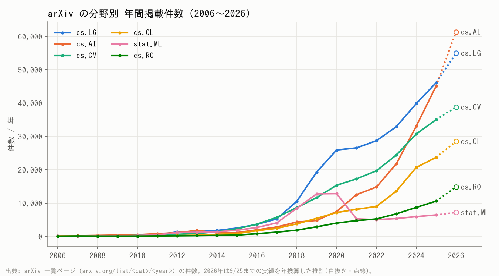
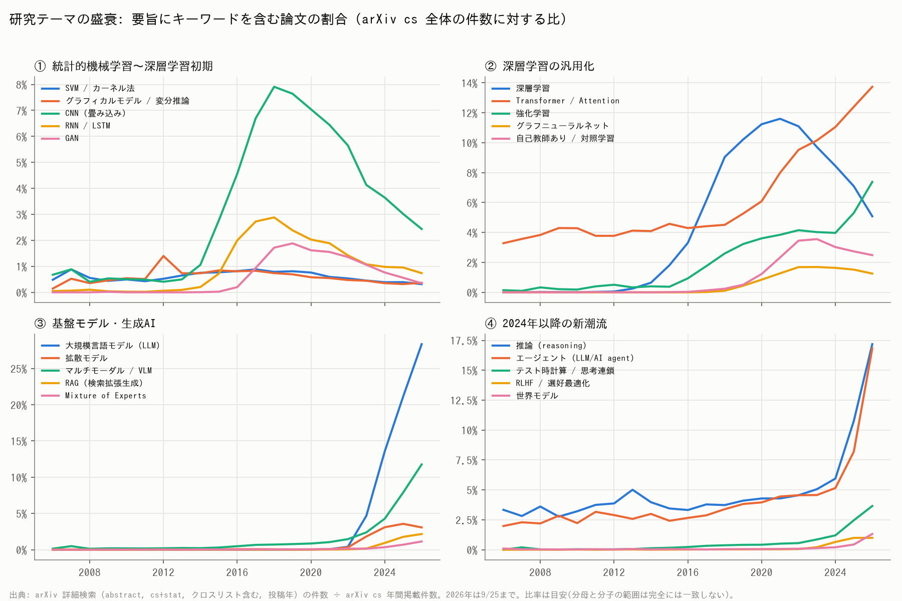
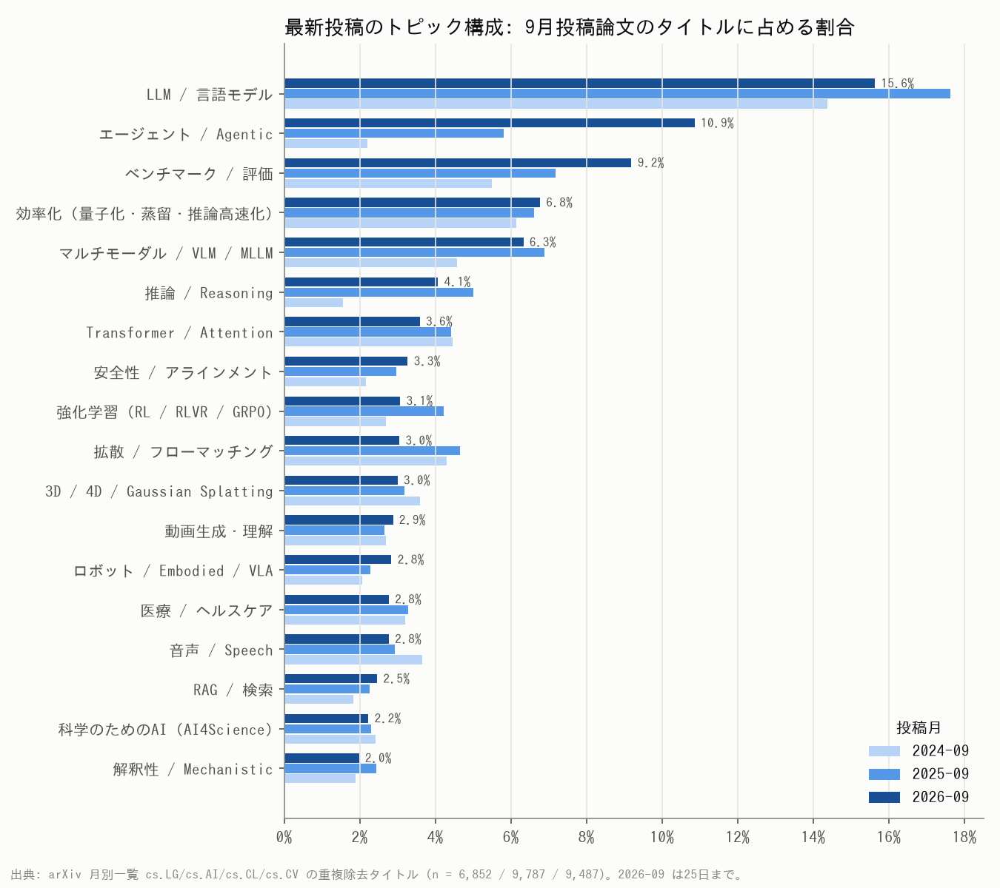

# 人工知能・機械学習 20年の潮流と、最新論文から見るアカデミアの技術動向

**作成日: 2026年9月26日**  
データ: arXiv (2006〜2026年9月25日の投稿)、Hugging Face Daily Papers (2026年8月1日〜9月25日)

---

## 0. 要約 (Key Findings)

1. **規模は20年で約75倍、2026年はさらに加速している。** arXiv の計算機科学 (cs) の年間掲載件数は、2006年の2,071件から2025年には152,238件に増えた。2026年は9月25日時点で既に142,934件あり、年換算すると約19.5万件 (前年比 +28%) になる。機械学習 (cs.LG) 単体では、同じ期間に 77件 → 46,098件 (約600倍) に増えた。
2. **研究の主語は「モデルの学習法」から「モデルに何をさせるか」に移った。** 2026年には、cs.AI の掲載件数 (年換算約61,000件) が 2013年以来はじめて cs.LG (約55,000件) を上回る見込みになった。論文の関心が、学習アルゴリズムそのものから、推論・計画・エージェントといった「AIシステム」の設計に移ったことを示している。
3. **手法の世代交代は約5年周期で起きてきた。** 要旨の出現率で見ると、SVM (2007年ピーク) → CNN・RNN (2018年ピーク) → GAN (2019年) → 「深層学習」という言葉自体 (2021年) → 自己教師あり学習・GNN・連合学習 (2023年) → 拡散モデル (2025年) の順にピークを迎えた。ピークを過ぎた技術は消えるのではなく、当たり前の部品になって個別に語られなくなる。
4. **2026年の三大テーマは「LLM」「推論」「エージェント」。** cs 全論文のうち要旨に含む割合は、LLM が 28.4%、推論 (reasoning) が 17.2%、エージェントが 16.8% だった。特にエージェントは1年で約2倍 (8.2% → 16.8%) になり、2026年9月の新着タイトルでは 10.9% を占める (2年前は 2.2%)。
5. **最前線の研究対象は「モデル単体」から「モデル+ハーネス+環境」の系に移った。** 2026年8〜9月の注目論文で急増している語は、ハーネス (agent harness)、記憶 (memory)、スキル、自己改善 (self-improvement)、on-policy 蒸留、世界モデル (world model / world-action model) である。いずれも1年前はほぼ見られなかった。
6. **今後の方向性は大きく6つ。** (a) 検証可能な報酬を使った強化学習による推論力の向上、(b) 長時間自律して動くエージェントとその実行基盤、(c) 世界モデルと身体性AI (ロボット・VLA)、(d) 評価科学 (ベンチマークと LLM-as-a-judge)、(e) 効率化 (MoE、KVキャッシュ圧縮、蒸留)、(f) 安全性・解釈性。

---

## 1. データと方法

| 分析 | データ源 | 方法 |
|---|---|---|
| 分野別の年間件数 | arXiv 年別一覧 `arxiv.org/list/<分類>/<年>` | 各ページの「Total of N entries」(クロスリストを含む) |
| テーマの盛衰 (25テーマ × 21年) | arXiv 詳細検索 | 要旨 (abstract) にキーワードを含む論文数 (cs+stat、クロスリスト含む、投稿年指定) を、cs の年間件数で割った比率 |
| 最新投稿のトピック構成 | arXiv 月別一覧 cs.LG / cs.AI / cs.CL / cs.CV | 2024年9月・2025年9月・2026年9月 (25日まで) の全タイトル (重複除去後 6,852 / 9,787 / 9,487 件) を正規表現で分類 |
| 注目論文の質的分析 | Hugging Face Daily Papers API | 2026年8月1日〜9月25日に取り上げられた 1,196 本の論文 (要旨・upvote 数・自動抽出キーワード) |

生データは `data/` に、収集・分析・作図のスクリプトは `scripts/` に置いた (付録で再現手順を示す)。

---

## 2. 20年の潮流: 6つの時代



| 時代 | 期間 | 主役の手法 | 象徴的な出来事 | 研究の中心的な問い |
|---|---|---|---|---|
| ① 統計的機械学習 | 2006–2011 | SVM・カーネル法、グラフィカルモデル、ベイズ非パラメトリクス、スパース推定 (Lasso)、ブースティング | Deep Belief Net (2006)、ImageNet データセット (2009)、GPU の汎用計算利用 | 理論保証のある学習を、凸最適化でどう設計するか |
| ② 深層学習革命 | 2012–2016 | CNN、word2vec、RNN/LSTM、seq2seq + Attention、GAN、深層強化学習 (DQN) | AlexNet (2012)、GAN (2014)、Adam (2014)、ResNet (2015)、AlphaGo (2016)、TensorFlow / PyTorch の公開 | 人手の特徴量設計を、学習に置き換えられるか |
| ③ Transformer と事前学習 | 2017–2019 | Transformer、BERT/GPT 型の事前学習、GNN、NAS/AutoML、敵対的サンプル、連合学習 | "Attention Is All You Need" (2017)、BERT (2018)、GPT-2 (2019) | 汎用的な表現を事前学習して、他のタスクに転移できるか |
| ④ スケーリングと基盤モデル | 2020–2022 | GPT-3、スケーリング則、ViT、CLIP、自己教師あり学習、拡散モデル、RLHF | GPT-3 (2020)、AlphaFold2 (2021)、Stable Diffusion (2022)、ChatGPT (2022年11月) | 規模を大きくすれば、能力は予測どおりに伸びるか |
| ⑤ LLM 全盛 | 2023–2024 | 指示調整、RLHF/DPO、RAG、LoRA などの効率的な微調整、マルチモーダルLLM、MoE、状態空間モデル (Mamba)、長文脈 | GPT-4 (2023)、Llama などのオープンウェイト、Sora (2024)、o1 (2024年9月) | LLM を安く・安全に・役立つ形で使うにはどうするか |
| ⑥ 推論・エージェント・世界モデル | 2025–2026 | 検証可能な報酬による強化学習 (RLVR/GRPO)、テスト時計算、エージェントとハーネス、on-policy 蒸留、世界モデル、VLA | DeepSeek-R1 (2025年1月)、LLM が数学オリンピック金メダル水準に到達 (2025年)、エージェント型コーディングの普及 | モデルは自分で考え、行動し、改善できるか |

### 件数の推移から読み取れること

- **2012年と2018年に屈曲点がある。** cs.LG は 2011年 468件 → 2012年 1,318件 (深層学習革命)、2017年 5,236件 → 2019年 19,263件 (深層学習の一般化と Transformer) と急増した。
- **2023年以降は cs.AI と cs.CL が牽引している。** ChatGPT 以降、cs.AI は 2022年 14,784件 → 2025年 45,099件 と3倍になった。2026年は年換算約61,000件で cs.LG を上回る見込みである。「言語」と「知能システム」を扱う分野が研究の主戦場になった。
- **ロボティクス (cs.RO) とマルチエージェント (cs.MA) も加速している。** 2026年の年換算では cs.RO が +40% (10,564 → 約14,800件)、cs.MA が +59% (2,437 → 約3,900件) で、主要分野の中で最も伸び率が高い。基盤モデルが身体とマルチエージェントの世界に広がりつつある。
- stat.ML は 2020年から2021年にかけて急減しているが、これは arXiv が cs.LG から stat.ML への自動クロスリストの運用を変えたことによるもので、統計的機械学習の研究が縮小したわけではない。

---

## 3. テーマの盛衰を定量的に見る



cs の全論文のうち、要旨にキーワードを含む論文の割合を下表に示す (1本の論文が複数テーマに該当しうる。2026年は9月25日まで)。

| テーマ | 2010 | 2014 | 2018 | 2022 | 2024 | 2025 | 2026 | ピーク年 |
|---|---:|---:|---:|---:|---:|---:|---:|---|
| 大規模言語モデル (LLM) | 0.0% | 0.0% | 0.0% | 0.4% | 13.6% | 21.1% | 28.4% | 2026 (上昇中) |
| 推論 (reasoning) | 3.2% | 4.0% | 3.7% | 4.6% | 5.9% | 10.8% | 17.2% | 2026 (上昇中) |
| エージェント (LLM/AI agent) | 2.2% | 3.0% | 3.4% | 4.6% | 5.2% | 8.2% | 16.8% | 2026 (上昇中) |
| 解釈性 / 説明可能AI | 4.6% | 4.4% | 5.5% | 7.2% | 7.7% | 10.5% | 14.3% | 2026 (上昇中) |
| Transformer / Attention | 4.3% | 4.1% | 4.5% | 9.5% | 11.1% | 12.4% | 13.7% | 2026 (上昇中) |
| マルチモーダル / VLM | 0.2% | 0.2% | 0.7% | 1.5% | 4.3% | 7.9% | 11.8% | 2026 (上昇中) |
| 強化学習 | 0.2% | 0.4% | 2.6% | 4.2% | 4.0% | 5.3% | 7.4% | 2026 (上昇中) |
| 深層学習 | 0.0% | 0.6% | 9.0% | 11.1% | 8.4% | 7.1% | 5.1% | 2021 |
| テスト時計算 / 思考連鎖 | 0.0% | 0.1% | 0.4% | 0.6% | 1.2% | 2.5% | 3.7% | 2026 (上昇中) |
| 拡散モデル | 0.0% | 0.1% | 0.1% | 0.3% | 3.1% | 3.6% | 3.1% | 2025 |
| Embodied / ロボット基盤モデル | 0.1% | 0.1% | 0.2% | 0.4% | 0.6% | 1.2% | 2.8% | 2026 (上昇中) |
| 量子化 / 蒸留 / 効率化 | 0.8% | 0.7% | 0.9% | 1.6% | 1.8% | 2.0% | 2.5% | 2026 (上昇中) |
| 自己教師あり / 対照学習 | 0.0% | 0.0% | 0.2% | 3.5% | 3.0% | 2.7% | 2.5% | 2023 |
| CNN (畳み込み) | 0.5% | 1.1% | 7.9% | 5.7% | 3.6% | 3.0% | 2.4% | 2018 |
| RAG (検索拡張生成) | 0.0% | 0.0% | 0.0% | 0.0% | 0.9% | 1.8% | 2.2% | 2026 (上昇中) |
| 世界モデル | 0.0% | 0.0% | 0.0% | 0.1% | 0.2% | 0.4% | 1.3% | 2026 (上昇中) |
| グラフニューラルネット | 0.0% | 0.0% | 0.1% | 1.7% | 1.6% | 1.5% | 1.3% | 2023 |
| Mixture of Experts | 0.0% | 0.0% | 0.0% | 0.1% | 0.3% | 0.7% | 1.1% | 2026 (上昇中) |
| 連合学習 | 0.0% | 0.0% | 0.0% | 1.4% | 1.4% | 1.3% | 1.0% | 2023 |
| RLHF / 選好最適化 | 0.0% | 0.0% | 0.0% | 0.1% | 0.6% | 1.0% | 1.0% | 2026 (上昇中) |
| 状態空間モデル / Mamba | 0.2% | 0.1% | 0.1% | 0.1% | 0.6% | 0.8% | 0.8% | 2026 (上昇中) |
| RNN / LSTM | 0.0% | 0.2% | 2.9% | 1.4% | 1.0% | 1.0% | 0.7% | 2018 |
| グラフィカルモデル / 変分推論 | 0.5% | 0.7% | 0.7% | 0.5% | 0.4% | 0.3% | 0.4% | 2012 |
| GAN | 0.0% | 0.0% | 1.7% | 1.4% | 0.8% | 0.6% | 0.3% | 2019 |
| SVM / カーネル法 | 0.5% | 0.8% | 0.8% | 0.5% | 0.4% | 0.4% | 0.3% | 2007 |

### 読み解き

- **「深層学習」という言葉は 2021年にピークを迎え、その後は減っている。** 深層学習が廃れたのではなく、前提になりすぎて書かれなくなった。CNN、RNN、GAN も同じ道をたどっており、技術が成熟すると「無名化」するのが典型的なパターンである。
- **LLM は4年で 0.4% → 28.4% に増えた。** 20年間で最大・最速のテーマ転換であり、CNN のピーク (7.9%) の3.6倍の規模に達している。
- **拡散モデルは 2025年に頭打ちになった。** 画像・動画生成は依然として盛んだが、手法としての拡散モデルは成熟期に入り、フローマッチングや世界モデル (動画生成を環境シミュレータとして使う方向) へ関心が移りつつある。
- **強化学習は再び伸びている。** 2018〜2023年は 4% 前後で横ばいだったが、2025年以降は 5.3% → 7.4% と上昇に転じた。ゲームやロボットの制御ではなく、LLM の推論力を鍛える手段 (RLVR、GRPO) として再評価されたことが背景にある。
- **解釈性・説明可能性も一貫して伸びている** (2022年 7.2% → 2026年 14.3%)。モデルの能力が上がるほど、「なぜそう答えたのか」を問う研究の需要が増している。

※ 「推論」「エージェント」「Transformer」は、LLM 以前から論理推論・マルチエージェントシステム・電力分野などで使われてきた語で、ベースラインとして数%を含む。重要なのは水準そのものではなく、2024年以降の傾きの変化である。

---

## 4. 最新論文から見るアカデミアの現在地 (2026年8〜9月)

### 4.1 9月の新着タイトルのトピック構成 (2024年・2025年・2026年の比較)



- **エージェントの割合が2年で約5倍になった** (2.2% → 5.8% → 10.9%)。タイトルに現れる主題としては LLM (15.6%) に次ぐ2位で、LLM 自体の割合 (2025年 17.6% → 2026年 15.6%) を侵食しつつある。「LLM を使った X」から「エージェントとしての X」へ、論文の打ち出し方が変わった。
- **ベンチマーク / 評価の割合も上昇が続いている** (5.5% → 7.2% → 9.2%)。能力が急速に伸びる中で、「何を、どう測るか」自体が主要な研究対象になった。
- **「推論」と「強化学習」は 2025年がピークで、2026年はやや落ち着いた** (推論 5.0% → 4.1%、RL 4.2% → 3.1%)。2025年の DeepSeek-R1 型の推論ブームが一巡し、推論と RL がタイトルに掲げるテーマから、エージェント訓練の標準的な部品へと変わりつつある。
- **ロボット / Embodied / VLA** (2.1% → 2.8%) と **安全性 / アラインメント** (2.2% → 3.3%) は着実に増えている。一方、Transformer アーキテクチャそのもの、音声、連合学習、GNN の割合は縮小している。
- 投稿量も増えている。9月前半25日間の件数 (9,487件) で、既に2025年9月の1か月分 (9,787件) に迫っている。

### 4.2 2026年に急浮上した新しいキーワード

| 新興語 | 2024-09 タイトル | 2025-09 タイトル | 2026-09 タイトル | HF注目論文 全体 | HF 上位200 |
|---|---:|---:|---:|---:|---:|
| memory (記憶) | 0.82% | 0.89% | 2.10% | 15.1% | 14.5% |
| world model (世界モデル) | 0.15% | 0.35% | 1.22% | 6.7% | 10.5% |
| tool use (ツール利用) | 0.47% | 0.73% | 1.08% | 14.0% | 24.0% |
| harness (エージェント実行基盤) | 0.20% | 0.11% | 0.81% | 8.2% | 16.0% |
| skills (スキル) | 0.16% | 0.21% | 0.72% | 6.8% | 9.5% |
| on-policy / self-distillation | 0.07% | 0.06% | 0.60% | 6.1% | 9.0% |
| hallucination (幻覚) | 0.45% | 0.68% | 0.57% | 2.3% | 1.0% |
| self-improvement / self-evolving | 0.07% | 0.31% | 0.54% | 5.3% | 11.0% |
| LLM-as-a-judge | 0.13% | 0.24% | 0.46% | 5.7% | 4.5% |
| GRPO / RLVR | 0.00% | 0.31% | 0.37% | 6.1% | 8.5% |
| GUI / computer use | 0.04% | 0.36% | 0.37% | 1.7% | 2.5% |
| diffusion LM (拡散言語モデル) | 0.00% | 0.28% | 0.28% | 0.8% | 1.5% |

「HF注目論文」は Hugging Face Daily Papers に取り上げられた 1,196 本 (タイトル+要旨)、「上位200」は upvote 数の上位 200 本での出現率。

**読み解き:**

- **ハーネス、自己改善、ツール利用は、注目度が高いほど出現率も高い** (上位200 本での割合が全体の約2倍)。コミュニティの関心が最も集まっているのは、「モデルを包む実行基盤 (ハーネス) を、モデル自身に設計・改善させる」という方向である。実際、2026年9月の注目論文には次のようなものが並ぶ。
  - *HarnessDev: Can LLMs Create and Evolve Their Own Agent Harness?*
  - *RRSI: Regularized Recursive Self-Improvement of Agent Harnesses*
  - *ModularRSI*
  - *StateM: … Terminal-Bench 2.1 via Harness Scaling*
- **記憶は 2026年に一気に倍増した** (タイトル 0.9% → 2.1%)。長時間動くエージェントには、文脈窓を超えて知識と経験を保持する仕組みが必須になり、継続学習 (continual learning) の研究が再び活発になっている。例: *Continual Learning Mechanisms Compose for Long-Horizon Memorization*、*Macaron-V1*。
- **on-policy 蒸留・自己蒸留が新しい事後学習 (post-training) の定番になりつつある** (タイトル 0.06% → 0.60% で10倍)。RL で得た能力を小さなモデルへ効率よく移す方法として、SFT と RL の中間に位置する手法である。
- **世界モデルは1年で約3.5倍になった。** 注目論文には次のようなものがある。
  - 動画生成モデルを物理シミュレータとして使う研究: *Training Object Permanence in World Models*、*Beyond Pixels: From Video Priors to 4D Worlds*
  - エージェントの訓練環境として使う研究: *Scaling Automatic Research Agents via World Models*
  - 行動を条件にした世界モデル: world-action models
- **幻覚 (hallucination) の割合は横ばいから減少に転じた。** 独立した研究テーマとしては成熟しつつあり、関心は評価や検証可能性の側に移っている。

### 4.3 注目論文に見る「研究の型」の変化

2026年8〜9月の upvote 上位論文には、次の共通点がある。

1. **技術報告型の論文が多い。** オープンな基盤モデル (数学・エージェント検索、音声、自動運転 VLM、教育、構造化データなど、分野特化型が増えている) を公開し、訓練レシピごと開示する論文が上位を占める。「fully open」「open-source」を掲げる論文の割合は、上位200 本で 15.5% だった。
2. **環境をスケールさせる研究が増えている。** データを集めるのではなく、エージェントが学習する環境を自動生成・拡張する研究である。例: *Terminal-Universe*、*EnvHarness*、*OpenART* (自動レッドチーミング環境)。
3. **「AI が AI 研究をする」研究が増えている。** 例: *Dr. Claw: An AI Scientist Workspace*、*Repo-To-Skill: Distilling GitHub Repositories Into AI4AI Skills*、*Learning to Discover Interesting Mathematics*。研究プロセスそのものの自動化が、アカデミアの主要テーマになった。
4. **潜在空間での推論を探る研究がある。** トークンを逐次生成する方式の代替として、*NCP: Next Concept Prediction*、*BDH-CQ: In-Context Learning with Recurrent Latent Reasoning*、拡散言語モデルなどが、少数ながら高い注目を集めている。

---

## 5. 総合: アカデミアの技術動向が進んでいる方向

20年の長期トレンドと最新投稿の短期シグナルを合わせると、現在の研究は次の方向に進んでいる。

| # | 方向性 | 長期トレンド (要旨比率) | 最新シグナル (2026年8〜9月) | 本質的な問い |
|---|---|---|---|---|
| A | **学習 → 推論・思考の時間スケーリング** | reasoning 5.9% → 17.2% (2024→2026)、テスト時計算 1.2% → 3.7% | GRPO/RLVR が定着し、潜在推論・拡散LMなどの代替方式も登場 | 学習時ではなく推論時に計算を使って、賢さを買えるか |
| B | **モデル → エージェント・システム** | agent 5.2% → 16.8%、cs.AI が cs.LG を逆転 | ハーネス、記憶、スキル、ツール利用、自己改善が急増 | 何時間・何日も自律して動き、自分の実行基盤を改善できるか |
| C | **テキスト → 世界 (マルチモーダル・身体性)** | マルチモーダル 4.3% → 11.8%、Embodied 0.6% → 2.8%、世界モデル 0.2% → 1.3% | 動画生成を世界シミュレータに使う研究、VLA、world-action model、自動運転 VLM | 物理世界を予測し、その中で行動できるか |
| D | **性能競争 → 評価の科学** | 解釈性 7.7% → 14.3% | ベンチマークと評価のタイトル比率 9.2% (2年で1.7倍)、LLM-as-a-judge が倍増 | 何を測れば本当の能力や危険性が分かるか |
| E | **巨大化 → 効率化・オープン化** | MoE 0.3% → 1.1%、効率化 1.8% → 2.5% | KVキャッシュ圧縮、on-policy 蒸留、完全オープンな訓練レシピ | 同じ能力を、より安く・誰でも再現できる形で得られるか |
| F | **人手のデータ → 自己生成・自己改善** | RLHF 1.0% で横ばい、自己改善が台頭 | 環境の自動生成、再帰的自己改善 (RSI)、AI 科学者 | 人間の監督なしに、能力とデータを自己増殖させられるか |

### 一言でまとめると

> **2006〜2020年の AI 研究は、「データから良い関数を学習する方法」を競っていた。2021年以降は「規模」を、そして2025〜2026年のいまは、「自律的に考え・行動し・自己改善するシステムを、どう作り、どう測り、どう安全に保つか」を競う段階に入っている。**

アカデミアの研究対象の単位は、「アルゴリズム」から「モデル」、そして「モデル+環境+ハーネス+評価」からなるシステムへと広がった。研究の多くはスケールで産業界と競うのではなく、評価手法、効率化、解釈性、オープンな再現、科学・教育・医療などの応用領域で独自の貢献をする方向に進んでいる。

---

## 6. 今後1〜2年の注目点

- **エージェントの信頼性と評価。** 長時間タスクのベンチマーク (Terminal-Bench、SWE-bench 系) の飽和と、その次の評価軸の設計。
- **継続学習と記憶の本格的な再興。** 事前学習と推論の間にある「使いながら学ぶ」モデルの研究。
- **世界モデルと身体性の統合。** 動画生成、3D/4D、VLA が一つの「世界モデル」として統合されるかどうか。
- **自己改善ループの安全性。** 再帰的自己改善やハーネスの自己進化が広がるほど、アラインメント、レッドチーミング、解釈性の重要性は増す。
- **Transformer 後継アーキテクチャの行方。** 状態空間モデル、線形注意、拡散LM、潜在推論は、現時点では少数派 (1% 前後) だが、効率化の要請から継続的に研究されている。

---

## 7. 限界と注意点

- **arXiv はプレプリントのサーバーであり、査読済みの学会論文とは一致しない。** 産業界の研究の一部や、非英語圏の研究は含まれにくい。
- **キーワード検索は語の使われ方の変化に影響される。** 同じ語が別の意味で使われる場合 (transformer = 変圧器、agent = 古典的なマルチエージェント、reasoning = 論理推論) や、技術が普及して名前が書かれなくなる「無名化」があるため、比率は絶対値ではなく傾向として読んでほしい。
- 分子 (cs+stat の要旨検索) と分母 (cs の年間掲載件数) の範囲は完全には一致しないため、比率は目安である。
- 2026年の値は9月25日までの部分年である (年換算の値は明記した)。
- **Hugging Face Daily Papers はコミュニティの選別を経たサンプルである。** 生成AIやエージェントなど、話題性の高い領域に偏っている。
- 第2章の時代区分と代表的な出来事は、定量データを補う一般的な研究史の整理であり、本分析のデータから導いたものではない。

---

## 付録: 再現手順

```bash
python3 scripts/arxiv_counts.py data/arxiv_counts.json   # 分野別の年間件数 (+キーワード件数)
python3 scripts/arxiv_keywords.py <out.json> <part> <n>   # キーワード件数の分割並列取得 (任意)
python3 scripts/fetch_recent.py                           # 月別タイトル + HF Daily Papers の取得
python3 scripts/analyze_recent.py                         # 最新投稿のトピック・新興語の分析
pip install matplotlib && python3 scripts/make_figures.py # 図の生成 (IPAGothic フォントを使用)
```

| ファイル | 内容 |
|---|---|
| `data/arxiv_counts.json` | 分野別の年間件数 (`lists`) と、25テーマの年別件数 (`keywords`) |
| `data/recent_titles.json` | 2024年・2025年・2026年9月の cs.LG / AI / CL / CV の全タイトル |
| `data/hf_daily_papers_2026-08_09.json` | HF Daily Papers (タイトル、要旨、upvote 数、キーワード) |
| `data/recent_analysis.json` | トピック比率、新興語の比率、HF 上位論文 |
| `figures/*.png` | 図1〜3 |
